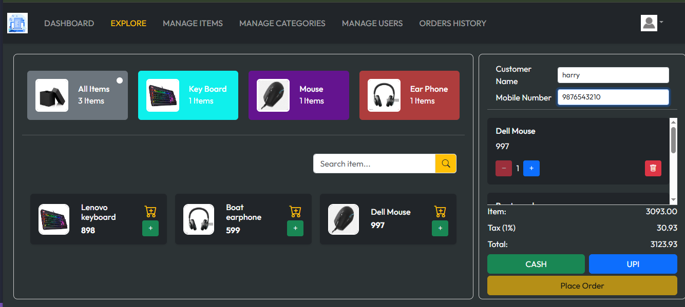

# 🛍️ Retail Billing System - Frontend

A **React + TailwindCSS** frontend for the **Retail Billing System**.  
It connects to the Spring Boot backend, supports **role-based access (USER & ADMIN)**, **JWT authentication**, and **Razorpay integration** for UPI & cash payments.

---

## 🚀 Features

- **Modern, responsive UI** built with TailwindCSS
- **JWT Authentication** (Login/Protected Pages)
- **Role-based Access Control**
- **Inventory Management UI**
- **Razorpay UPI Payment Integration**
- **Dashboard for Orders, Items, and Categories**
- **Secure API calls to backend**
- **Mobile-friendly design**

---

## 🛠 Tech Stack

- **Frontend Framework:** React (Vite)
- **Styling:** TailwindCSS
- **State Management:** React Hooks & Context API
- **Payment Gateway:** Razorpay Web SDK
- **Backend API:** Spring Boot (JWT secured)

---

## 📸 Screenshots

### 🔹 Dashboard


### 🔹 Explore Section



### 🔹 Manage Items Section


### 🔹 Order History Section


## ⚙️ Installation & Setup

### **1️⃣ Clone the Repository**

```bash
git clone https://github.com/binayak597/retail_billing_with_react.git
cd retail-billing-frontend
```

### **2️⃣ Install Dependencies**

```bash
npm install
```

### **3️⃣ Configure Environment Variables**

```env
# Backend API URL
VITE_API_BASE_URL=http://localhost:5454/api/v1.0

# Razorpay Key (from Razorpay Dashboard)
VITE_RAZORPAY_KEY=your_razorpay_key_here
```

### **4️⃣ Run the Development Server**

```bash
npm run dev
```

- Frontend will be available at:

```arduino
http://localhost:5173
```

## 🔐 Authentication Flow

1.User logs in with email & password.

2.Backend returns a JWT token.

3.Token is stored in local storage.

4.All API requests include:

```makefile
Authorization: Bearer <token>
```

5.Protected pages are accessible based on role (USER or ADMIN).

## 💳 Razorpay Payment Flow

1.User adds items to cart and clicks Checkout.

2.Frontend calls backend to create a Razorpay order.

3.Razorpay payment UI opens (UPI / Card / Netbanking).

4.On success:

Payment details sent to backend

Order marked as completed

5.On failure:

User is notified

Payment can be retried

## 📦 Build for Production

```bash
npm run build
```

The production-ready files will be generated in the dist/ folder.
Deploy them to any static hosting service (Vercel, Netlify, etc.).

## 📌 Demo Credentials

To explore the application, use the following login credentials:

- **Username/Email:** admin@example.com
- **Password:** 123456

### (NOTE)

- #### Admin can only create user.
- #### User can not create by own.
- #### Admin will create and pass the credentials to user.

## 📜 License

This project is open-source. Feel free to **fork**, modify, and use it as per your needs.

## 🎯 Contributing

Contributions are welcome! If you find any bugs or have suggestions for improvements, feel free to submit an issue or a pull request.

## 🙌 Connect

If you liked this project, don't forget to ⭐ the repository! You can check out my other projects on [GitHub](https://github.com/binayak597).

Happy coding! 🚀
